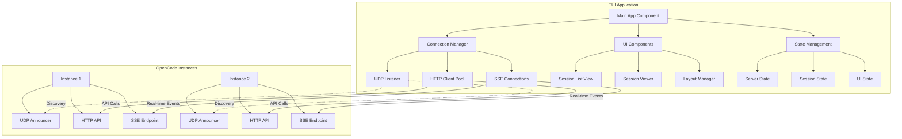
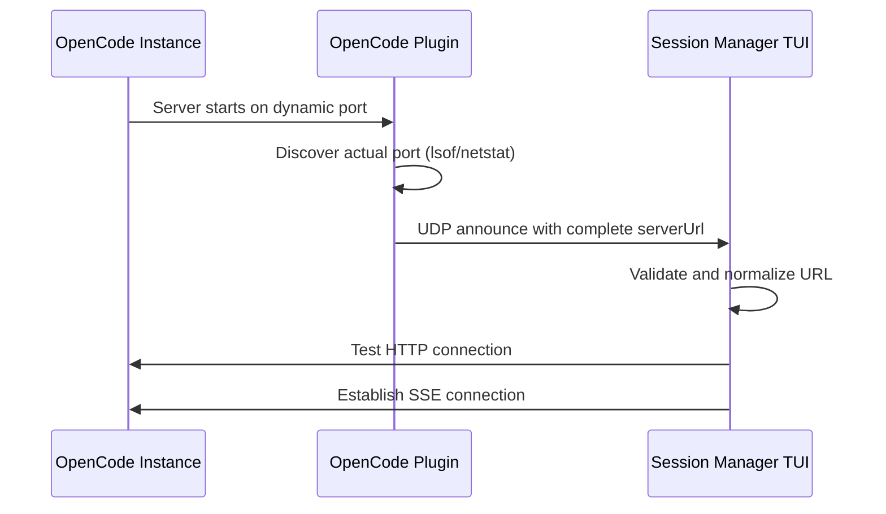

# Design Document

## Overview

The OpenCode Session Monitor is a full-screen Terminal User Interface (TUI) application built with React and Ink that provides real-time monitoring and management of OpenCode instances and their active sessions. The system uses a modern component-based architecture with efficient state management, responsive layouts, and comprehensive testing infrastructure.

The application discovers OpenCode instances via UDP announcements, connects to their HTTP APIs for session data, and provides an intuitive interface for monitoring session states, viewing live session output, and performing management operations.

## Architecture

### High-Level Architecture



### Component Architecture

The application follows a layered architecture with clear separation of concerns:

1. **Presentation Layer**: React/Ink components for UI rendering
2. **Application Layer**: State management and business logic
3. **Infrastructure Layer**: Network communication and external integrations
4. **Domain Layer**: Core entities and business rules

## Components and Interfaces

### Core Components

#### 1. Connection Manager
Manages discovery and communication with OpenCode instances.

```typescript
interface ConnectionManager {
  // Server discovery and management
  handleAnnounce(packet: AnnouncePacket): Promise<void>
  handleShutdown(packet: ShutdownPacket): void
  getServers(): Server[]
  
  // Session management
  getSessions(): Session[]
  getServerSessions(serverUrl: string): Session[]
  abortSession(sessionId: string): Promise<boolean>
  sendMessage(sessionId: string, message: string): Promise<boolean>
  
  // Event handling
  onConnectionChange(callback: ConnectionChangeCallback): void
  onSessionsUpdate(callback: SessionsUpdateCallback): void
  onSessionEvent(callback: SessionEventCallback): void
}
```

#### 2. State Manager
Centralized state management using React Context and hooks.

```typescript
interface AppState {
  servers: Map<string, Server>
  sessions: Map<string, Session>
  ui: UIState
}

interface UIState {
  viewMode: 'grouped' | 'flat'
  selectedIndex: number
  collapsedGroups: Set<string>
  sessionView: SessionViewState | null
  terminalSize: { width: number; height: number }
}
```

#### 3. Layout Manager
Responsive layout system that adapts to terminal size.

```typescript
interface LayoutManager {
  calculateLayout(terminalSize: TerminalSize): LayoutConfig
  shouldUseSplitView(width: number): boolean
  getVisibleItemCount(height: number): number
}

interface LayoutConfig {
  mainWidth: number
  sidebarWidth: number
  headerHeight: number
  footerHeight: number
  contentHeight: number
}
```

#### 4. Session Viewer
Full-screen session monitoring with message streaming.

```typescript
interface SessionViewer {
  connectToSession(sessionId: string): Promise<void>
  sendMessage(message: string): Promise<void>
  abortSession(): Promise<void>
  handlePermission(permissionId: string, allow: boolean): Promise<void>
  scrollToMessage(index: number): void
}
```

## Network Communication and Port Discovery

The system relies on OpenCode instances to broadcast their actual HTTP server URLs via UDP announcements. This is critical because OpenCode servers may use dynamic ports that cannot be predicted.

### Port Discovery Strategy

1. **UDP Announcements**: OpenCode instances must determine their actual listening port (using tools like `lsof` if necessary) and include the complete HTTP URL in announce packets
2. **No Port Assumptions**: The TUI makes no assumptions about OpenCode server ports and relies entirely on announced URLs
3. **URL Validation**: Announced server URLs are validated and normalized before use
4. **Connection Testing**: Initial HTTP connections verify that announced URLs are accessible

### Discovery Flow



### Network Interfaces

#### UDP Discovery Protocol
```typescript
interface AnnouncePacket {
  type: 'oc.announce'
  serverUrl: string  // Complete HTTP URL with actual listening port
  project: string
  directory: string
  branch: string
  instanceId: string
  ts: number
}

interface ShutdownPacket {
  type: 'oc.shutdown'
  instanceId: string
  ts: number
}
```

#### HTTP API Integration
```typescript
interface OpenCodeAPI {
  // Session management
  getSessionStatus(): Promise<Record<string, SessionStatus>>
  getSession(id: string): Promise<SessionData>
  getSessionMessages(id: string): Promise<Message[]>
  abortSession(id: string): Promise<void>
  sendMessage(id: string, content: string): Promise<void>
  
  // Permission handling
  respondToPermission(id: string, response: PermissionResponse): Promise<void>
}
```

#### SSE Event Stream
```typescript
interface SSEEvent {
  type: 'session.status' | 'session.idle' | 'session.updated' | 'permission.updated'
  properties: Record<string, unknown>
}
```

## Data Models

### Core Entities

#### Server
Represents an OpenCode instance.

```typescript
interface Server {
  serverUrl: string
  instanceId: string
  project: string
  directory: string
  branch: string
  
  // Connection state
  status: 'connecting' | 'connected' | 'disconnected'
  lastAnnounce: number
  reconnectAttempts: number
  
  // Network connections
  client?: OpenCodeClient
  eventAbort?: AbortController
}
```

#### Session
Represents an active session within an OpenCode instance.

```typescript
interface Session {
  id: string
  serverUrl: string
  parentID?: string
  
  // Session metadata
  title?: string
  status: 'idle' | 'busy' | 'running' | 'pending'
  directory?: string
  
  // Tracking data
  busySince?: number
  discoveredAt: number
  
  // Statistics
  cost?: number
  tokens?: { input: number; output: number; total: number }
  model?: string
  
  // Interactive state
  pendingPermission?: Permission
}
```

#### Message
Represents a message in a session conversation.

```typescript
interface Message {
  info: MessageInfo
  parts: MessagePart[]
}

interface MessageInfo {
  role: 'user' | 'assistant'
  cost?: number
  tokens?: { input?: number; output?: number }
  providerID?: string
  modelID?: string
}

interface MessagePart {
  type: 'text' | 'tool' | 'reasoning' | 'step-start' | 'step-finish'
  id?: string
  text?: string
  tool?: string
  state?: ToolState
  reasoning?: string
}
```

### UI Models

#### Instance (Display Model)
Unified view model for displaying sessions in the UI.

```typescript
interface Instance {
  instanceId: string
  sessionID?: string
  parentID?: string
  status: 'idle' | 'busy' | 'pending' | 'stale'
  
  // Display information
  project?: string
  branch?: string
  title?: string
  directory?: string
  
  // Statistics
  cost?: number
  tokens?: { input: number; output: number; total: number }
  model?: string
  
  // UI state
  isLongRunning?: boolean
  busyDuration?: number
}
```

## Error Handling

### Error Categories

1. **Network Errors**: Connection failures, timeouts, DNS resolution
2. **Protocol Errors**: Malformed packets, API response errors
3. **State Errors**: Invalid state transitions, data consistency issues
4. **UI Errors**: Rendering failures, input validation errors

### Error Handling Strategy

#### Connection Resilience
- Automatic reconnection with exponential backoff
- Circuit breaker pattern for failed connections
- Graceful degradation when servers are unavailable

```typescript
interface ConnectionErrorHandler {
  handleConnectionError(error: Error, server: Server): void
  scheduleReconnect(server: Server): void
  shouldRetry(error: Error, attempts: number): boolean
}
```

#### User Error Feedback
- Non-blocking error notifications in UI
- Contextual error messages with suggested actions
- Error recovery options where applicable

```typescript
interface ErrorNotification {
  type: 'error' | 'warning' | 'info'
  message: string
  context?: string
  actions?: ErrorAction[]
  dismissible: boolean
}
```

## Testing Strategy

### Testing Architecture

The testing strategy employs a dual approach combining unit tests for specific functionality and property-based tests for comprehensive validation of system behavior.

#### Unit Testing
- **Component Testing**: React component behavior and rendering
- **Integration Testing**: API interactions and state management
- **Edge Case Testing**: Error conditions and boundary values
- **Mock Testing**: External dependencies and network calls

#### Property-Based Testing
- **Universal Properties**: System invariants that must hold across all inputs
- **State Consistency**: Validation of state transitions and data integrity
- **Network Resilience**: Communication protocol correctness
- **UI Behavior**: Interface responsiveness and user interaction patterns

### Test Infrastructure

#### Mock OpenCode Simulator
A comprehensive simulation system for testing without real OpenCode instances.

```typescript
interface MockOpenCodeSimulator {
  createInstance(config: InstanceConfig): MockInstance
  simulateSessionStateChange(sessionId: string, newState: SessionState): void
  simulatePermissionRequest(sessionId: string, permission: Permission): void
  simulateNetworkFailure(instanceId: string, duration: number): void
  generateRealisticWorkload(): void
}
```

#### Automated Test Scenarios
- **Discovery Flow**: Instance announcement and registration
- **Session Lifecycle**: Creation, state changes, completion
- **Error Recovery**: Network failures and reconnection
- **User Interactions**: Navigation, selection, and operations

#### Debug and Monitoring Tools
- **Packet Inspector**: UDP traffic analysis and debugging
- **State Visualizer**: Real-time state tree inspection
- **Performance Profiler**: Rendering and update performance metrics
- **Event Logger**: Comprehensive event tracing and analysis

### Testing Configuration

**Property-Based Test Settings**:
- Minimum 100 iterations per property test
- Each test tagged with feature and property reference
- Comprehensive input generation for realistic scenarios
- Automated shrinking for minimal failing examples

**Unit Test Coverage**:
- Target 90%+ code coverage for core business logic
- Focus on critical paths and error conditions
- Integration points between components
- User interaction flows and edge cases

## Correctness Properties

*A property is a characteristic or behavior that should hold true across all valid executions of a system—essentially, a formal statement about what the system should do. Properties serve as the bridge between human-readable specifications and machine-verifiable correctness guarantees.*

### Property 1: Instance Discovery and Lifecycle Management
*For any* OpenCode instance announcement or shutdown packet, the Session_Manager should correctly register new instances, update existing instances, and remove shutdown instances from monitoring
**Validates: Requirements 1.1, 1.2, 1.4**

### Property 2: Stale Instance Detection
*For any* instance that stops broadcasting for more than the configured timeout period, the Session_Manager should mark it as stale and eventually remove it from monitoring
**Validates: Requirements 1.3**

### Property 3: Active Session Retrieval
*For any* OpenCode server status endpoint response, the Session_Manager should process only the sessions returned by the status endpoint and ignore any sessions not currently active/loaded
**Validates: Requirements 2.1**

### Property 4: Session State Transition Handling
*For any* session state change event (busy to idle, metadata updates), the Session_Manager should update the session state correctly and trigger appropriate notifications when user intervention is needed
**Validates: Requirements 2.2, 2.4**

### Property 5: Long-Running Session Detection
*For any* session that has been in a busy state longer than the configured threshold, the Session_Manager should flag it as long-running with appropriate indicators
**Validates: Requirements 2.3**

### Property 6: Parent-Child Session Relationship Tracking
*For any* set of sessions with parent-child relationships, the Session_Manager should maintain and display these relationships correctly throughout the session lifecycle
**Validates: Requirements 2.5**

### Property 7: SSE Connection and Message Processing
*For any* session selected for viewing, the Session_Viewer should establish SSE connections correctly and process incoming messages, tool executions, and permission requests in real-time
**Validates: Requirements 3.1, 3.2, 3.3, 3.4**

### Property 8: Session Management Operations
*For any* user-initiated session operation (abort, permission response, message sending), the Session_Manager should send the correct API requests and handle responses appropriately
**Validates: Requirements 4.1, 4.2, 4.4**

### Property 9: Instance Grouping and Organization
*For any* set of instances, the Session_Manager should group them correctly by project:branch combination and maintain accurate group statistics (counts, costs, tokens)
**Validates: Requirements 5.1, 5.4**

### Property 10: View Mode and Navigation State Management
*For any* user navigation action (view mode toggle, group expansion, item selection), the Session_Manager should update the UI state correctly and maintain consistent navigation behavior
**Validates: Requirements 5.2, 5.3, 7.3, 7.4**

### Property 11: Sorting and Ordering Consistency
*For any* collection of groups and sessions, the Session_Manager should sort groups alphabetically and sessions within groups by creation time consistently
**Validates: Requirements 5.5**

### Property 12: Notification Triggering Logic
*For any* session state change, the Session_Manager should send notifications only when user intervention is required (work completion, permission requests) and respect notification configuration settings
**Validates: Requirements 6.1, 6.2, 6.3, 6.4**

### Property 13: Responsive Layout Adaptation
*For any* terminal size change, the Session_Manager should recalculate layout dimensions appropriately, handle edge cases (very small terminals), and maintain usable interface elements
**Validates: Requirements 7.1, 8.1, 8.5**

### Property 14: Network Communication Protocol Compliance
*For any* network operation (UDP listening, HTTP connections, SSE subscriptions), the Session_Manager should use correct protocols, extract complete server URLs from announce packets (including dynamic ports), handle connection failures gracefully, and implement automatic reconnection with exponential backoff
**Validates: Requirements 9.1, 9.2, 9.3, 9.4, 9.5**

### Property 15: Performance and Resource Management
*For any* system operation, the Session_Manager should respect update throttling limits, maintain bounded message history, clean up stale resources, and render only visible content
**Validates: Requirements 10.1, 10.2, 10.4, 10.5**

### Property 16: Configuration and Runtime Mode Management
*For any* configuration source (environment variables, command-line arguments), the Session_Manager should parse and apply settings correctly, and support different runtime modes (normal, daemon, headless)
**Validates: Requirements 11.1, 11.2, 11.3, 11.5**

### Property 17: Testing Infrastructure Correctness
*For any* testing or debugging mode, the Session_Manager should generate appropriate mock data, log debug information correctly, and support automated test scenarios without interfering with normal operation
**Validates: Requirements 12.1, 12.2, 12.3, 12.4, 12.5**